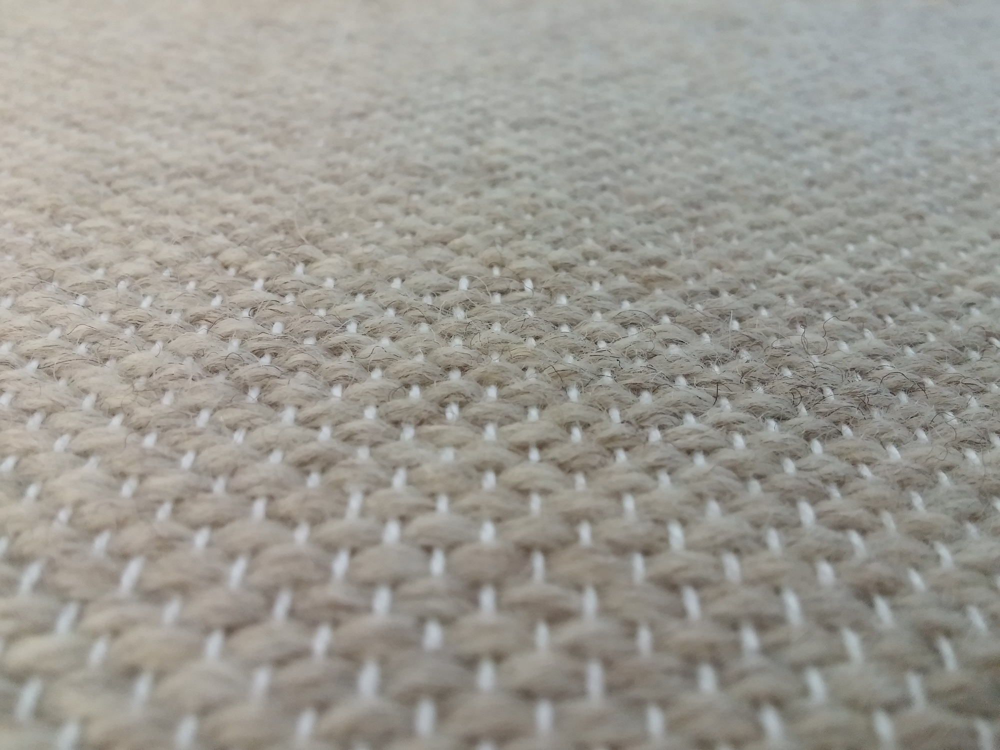
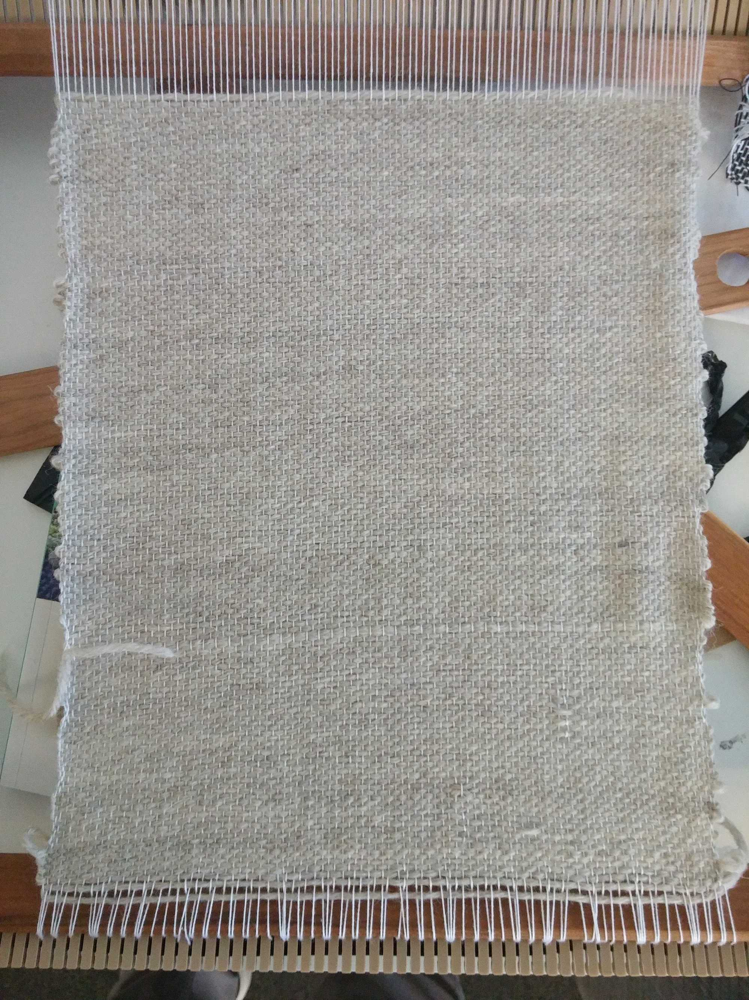
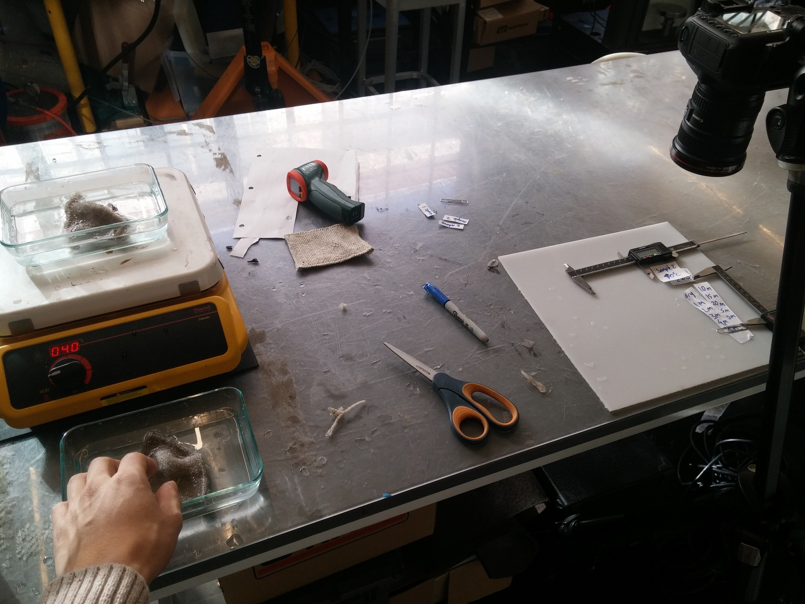
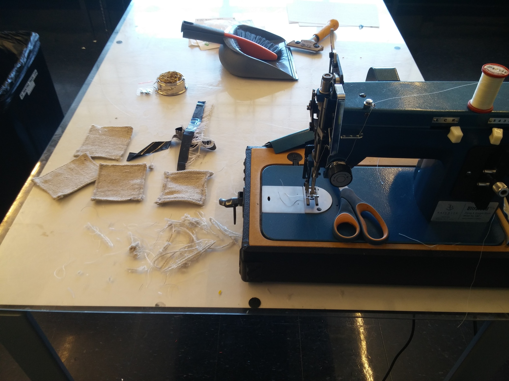

# Active Weaving

Working with the [Self Assembly Lab](http://www.selfassemblylab.net), I explored how to fabricate textiles and woven materials that change shape under different environmental conditions. With such a material, different behaviors can be "programmed" by changing the underlying patterns and geometries used in the weaving process.

---

## Behind the Scenes

---

Supported by: MIT Self Assembly Lab

Learning Focus: Cloth Weaving, Sewing, Shape Changing Materials

Media: Poster, Research Report

Hardware: Rigid Heddle Loom, Sewing Machine, Digital Camera

Date: January 2017
